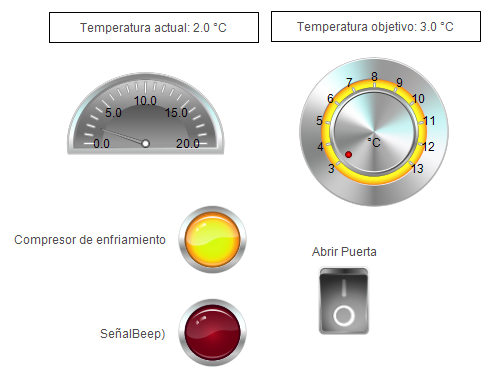
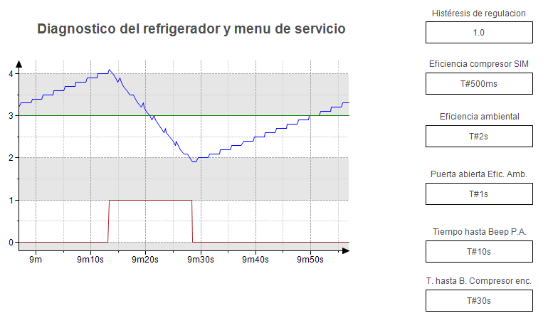
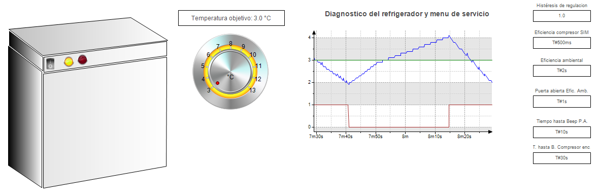

# Control de temperatura
Este ejemplo esta basado en el tutorial [Your First CODESYS Program](https://help.codesys.com/webapp/_cds_tutorial_refrigerator_control;product=codesys;version=3.5.15.0). 

La aplicación que se desarrolla implementa y simula un controlador sencillo para regular la temperatura en un refrigerador, que utiliza un compresor para disminuir la temperatura. El controlador es ON/OFF, este enciende el compresor cuando la temperatura esta a *S+d* y lo apaga cuando la temperatura esta a *S-d*, en otro caso el compresor mantiene su estado anterior, *S* es la temperatura base de control y *d* es un desfase para la temperatura base de control.

### Entradas
+ Sensor de temperatura
+ Indicador de puerta abierta.
+ Temperatura base de control *S*.
+ Temperatura de desfase *d*.
+ Tiempo de retardo para la alarma de puerta abierta.
+ Tiempo de retardo para la alarma de sobre esfuerzo de compresor.

### Salidas
+ Señal de encendido del compresor.
+ Señal de alarma de puerta abierta/sobre esfuerzo de compresor.

### Visualizaciones
hay tres visualizaciones implementadas:
+ *Visualizar_proceso*, que muestra un tablero de control básico del sistema:

+ *Diagnostico*, que muestra un grafico de la variación de la temperatura del refrigerador, temperatura base de control y la señal
de control del compresor con respecto al tiempo:

+ *Live_visu*, que presenta una simulación del refrigerador (se puede presionar la puerta para simular que se abrio o cerro la puerta del refrigerador), que incluye perillas, lamparas y graficos para hacer más facil la visualización de las variables:

